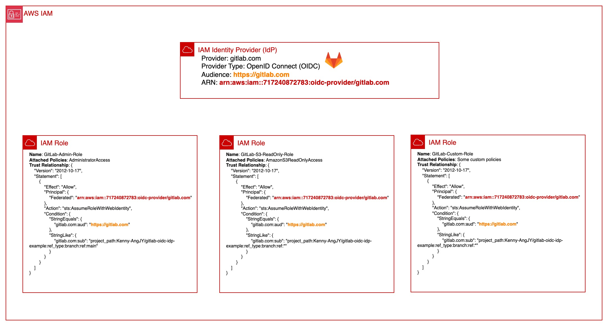

### Check out my article on "Hard coding your AWS access keys in GitLab or GitHub variables? There's a better way"
https://medium.com/@kennyangjy/hard-coding-your-aws-access-keys-in-gitlab-or-github-variables-theres-a-better-way-3d79f30d5e3f

---

### To provision the resources in this repository:
1. `git clone https://github.com/Kenny-AngJY/github-oidc-idp-example.git`
2. `cd terraform`
3. Overwrite the default value for "namespace" and "project_name" in *variables.tf* with your own.
4. `terraform init`
5. `terraform plan`
6. `terraform apply`  
Two resources will be created. As no backend is defined, the default backend will be local.
### Clean-up
1. `terraform destroy`